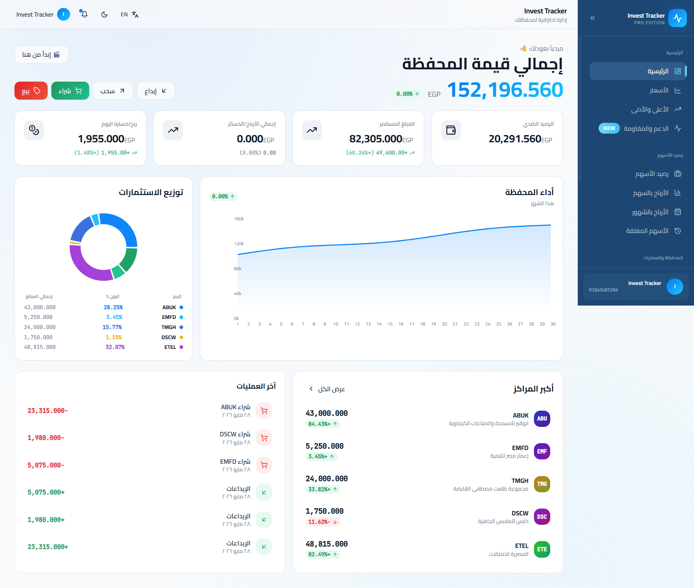

# 📊 Invest Tracker

**Invest Tracker** is a comprehensive investment management and market tracking platform designed to help investors manage their portfolios, track transactions, analyze performance, monitor stocks, and access useful investment insights from one place.

The platform combines **portfolio management, market monitoring, investment tools, educational content, and financial insights** into a unified experience.

---

## 🧠 Overview

Invest Tracker was built to solve one of the most common problems faced by investors: managing investment data across spreadsheets, broker applications, and different sources.

Instead of relying on manual calculations and scattered information, Invest Tracker provides a centralized platform where investors can:

- Track their investment operations
- Monitor portfolio performance
- Follow stock prices
- Analyze profit and loss
- Monitor support and resistance levels
- Organize favorite stocks and watchlists
- Access educational and financial content
- Use investment calculation tools
- Review their investment activity and history

---

# 📸 Project Screenshots

The following screenshots showcase the main areas and features of Invest Tracker.

---

## 🌐 Platform & Authentication

### Landing Page

  

### Registration & Login

  
  

---

## 🖥️ Dashboard

The main dashboard provides a centralized overview of the investor's portfolio and current investment activity.

  

---

## 💡 Portfolio Management

The core of Invest Tracker is a complete **Portfolio Tracking System**.

Users can record and manage:

- 💰 Deposits
- 💸 Withdrawals
- 📈 Buy operations
- 📉 Sell operations

Each transaction can include:

- Transaction date
- Operation type
- Asset / Stock
- Quantity
- Price
- Total amount

### Portfolio & Holdings

  

### Wallet

  

### Buy Operation

  

### Sell Operation

  

### Bought Operations

  

### Sold Operations

  

### Closed Positions

  

---

## 📊 Portfolio Analytics

Invest Tracker provides portfolio-level insights including:

- Total portfolio value
- Available cash balance
- Profit & Loss
- Investment performance
- Asset distribution
- Transaction history
- Portfolio composition
- Investment statistics
- Recent operations

### Profit by Stock

  

### Profit by Month

  

---

## 📈 Market Tracking

The platform provides tools for monitoring the stock market and individual securities.

Features include:

- Real-time market price tracking
- Historical price data
- Daily OHLCV data
- Stock information
- Market monitoring
- Price movement tracking

### Stock Prices

  

### Top Movers

  

---

## 🎯 Support & Resistance

Invest Tracker includes a dedicated **Support & Resistance** section designed to help investors monitor important technical price levels.

The system provides:

- Support levels
- Resistance levels
- Multiple support and resistance zones
- Current price positioning
- Price distance from important levels
- Historical market data used for analysis

  

---

## ⭐ Favorites & Watchlists

Users can organize stocks they are interested in through **Favorite Lists / Watchlists**.

This allows investors to:

- Add stocks to favorite lists
- Create and manage multiple lists
- Quickly access monitored stocks
- Follow selected securities
- Keep important stocks organized

  

---

## 🔍 Stock Screener

Invest Tracker includes a technical stock screening system designed to help investors discover stocks based on multiple market and technical characteristics.

The screening system can analyze factors such as:

- Trend
- Momentum
- Relative strength
- Liquidity
- Volatility
- Trading volume
- Market position
- Technical structure

The system generates a structured result that helps users understand the current technical condition of a stock.

  

---

## 🛠️ Investment Tools

The platform includes a collection of tools designed to simplify common investment calculations.

Examples include:

- Risk / Reward Calculator
- Position Size Calculator
- Net Profit Calculator
- Capital Growth Calculator
- Investment-related calculators and utilities

  

---

## 📚 Investment Guide & Educational Content

Invest Tracker includes an educational content section focused on helping investors improve their understanding of investing and financial markets.

Content can cover topics such as:

- Investment education
- Common investor mistakes
- Portfolio management
- Risk management
- Trading psychology
- Market concepts
- Investment strategies
- Financial awareness

The goal is to provide practical educational material rather than simply displaying market data.

---

## 📰 Financial & Market Content

The platform also includes a **Blog / Content Management System** supporting multiple content categories.

Content can include:

- 📰 Market News
- 📚 Educational Articles
- 💡 Investment Awareness
- 📊 Market Insights
- 💰 Personal Finance
- 📈 Investment Topics
- 🧠 Investor Psychology
- 🔎 Other financial content

This turns Invest Tracker into more than a portfolio tracking application by combining investment tools with useful financial content.

  

---

## ❓ Help & Information

Invest Tracker also provides dedicated informational pages to help users understand the platform and its policies.

### FAQ

  

### About Invest Tracker

  

---

## 🔐 Privacy & Terms

The platform includes dedicated legal and privacy pages covering important information related to using the service.

### Privacy Policy

  

### Terms & Conditions

  

---

## 🔔 Notifications

The platform supports notifications designed to keep investors informed about important portfolio and market-related activities.

Examples include:

- Portfolio reminders
- Transaction recording reminders
- Subscription notifications
- Market-related notifications
- Support & resistance updates
- Important account notifications

---

## 👤 User Account & Subscription System

Invest Tracker includes a user account and subscription system that allows the platform to provide different access levels and subscription packages.

The platform supports:

- User accounts
- Subscription packages
- Free trial access
- Subscription activation
- Subscription renewal
- Membership management

---

## 🤝 Referral & Partnership System

Invest Tracker includes a referral system that allows users to participate in the platform's partnership program.

Each user can have a personal referral link and receive rewards from eligible referred subscriptions.

The system handles:

- Unique referral links
- Referral tracking
- Subscription-based rewards
- Reward activation
- Earnings tracking
- Withdrawal requests

---

## 🏗️ System Architecture

The platform is built around a modular architecture separating the main application responsibilities.

### Core Modules

- Portfolio Management
- Transaction Management
- Market Data
- Stock Monitoring
- Support & Resistance
- Stock Screener
- Favorites & Watchlists
- Investment Tools
- Notifications
- Blog & Content
- User Management
- Subscription Management
- Referral System
- Analytics

---

## 🛠️ Tech Stack

### Backend

- ASP.NET Core
- C#
- RESTful APIs

### Frontend

- React
- TypeScript
- Modern UI Components

### Database

- Microsoft SQL Server

### Data & Processing

- Financial Market Data
- Historical OHLCV Data
- Technical Analysis Processing

---

## 🎯 Project Goals

Invest Tracker aims to provide investors with a centralized environment where they can:

- Track their investments
- Understand portfolio performance
- Monitor the market
- Follow important stocks
- Identify technical levels
- Organize watchlists
- Perform investment calculations
- Learn through educational content
- Stay informed through financial and market content

The long-term goal is to build a complete ecosystem for investors rather than simply another portfolio tracking application.

---

## 🚀 Vision

**Invest Tracker aims to become a complete digital investment companion for investors.**

From recording the first transaction, to monitoring a portfolio, analyzing stocks, following market levels, learning about investing, and making better-informed decisions — everything is designed to be accessible from one platform.

---

## 🌐 Live Platform

Visit the live platform:

**[Invest Tracker](https://investtracker.online/)**

---

## 👨‍💻 Author

**Abd El Rahman Elsaeedy**

---

> **Note:** This repository is a public showcase of the Invest Tracker project. The source code is not publicly available.
